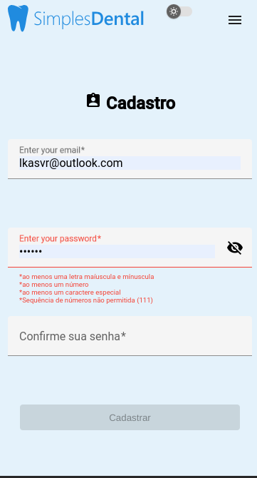

# Simples Dental Front-End Challenge

Este projeto foi gerado utlizando [Angular CLI](https://github.com/angular/angular-cli) version 17.0.0.

### Link do Deploy:

</br>

## Layout da Landing Page


#


## Decisões Tomadas para Cumprimento dos Requisitos

- Manipulação da lógica das animações via servidor next

  📌 Criar uma tela de autenticação com Login salvando no localStorage.
   **Processo de tomada da decisão**: tela de autenticação e tela de registro, com dados de cadastro sendo persistido no localStorage, e dados de sessão autenticada persistida no sessionStorage. Foi feito dessa forma considerando a finalidade de cada tipo de recurso de armazenamento, sendo o ideal para um sessão logada o sessionStorage
  

  📌 Mostrar os álbuns da rota: https://jsonplaceholder.typicode.com/albums
   **Processo de tomada da decisão**: listagem tem sua visualização permitida somente após usuário se autenticar

  📌 Mostrar 1 miniatura por álbum e que será a primeira foto de dentro do álbum.
  **Processo de tomada da decisão**: na galeria, onde se exibe todos albums, sendo apenas 10 fotos por album exibidas a primeira foto é a capa do album.


  📌 Ao clicar no álbum, mostrar as 10 primeiras fotos de cada álbum https://jsonplaceholder.typicode.com/photos
  **Processo de tomada da decisão**: ao se clicar no album abre-se a página dedicada ao álbum, onde é visualizado somente o álbum selecionado e suas 10 fotos

</br>

## Instruções de Execução do Projeto

### **AMBIENTE DE DESENVOLVIMENTO**

Primeiro, clone este reposiótio:

```bash
$ git clone git@github.com:lkasvr/simples-dental-angular-challenge.git
```
Depois, execute os comandos abaixo na raíz do projeto:

```bash
npm install
```

```bash
ng serve
```

Navegue para `http://localhost:4200/`.

